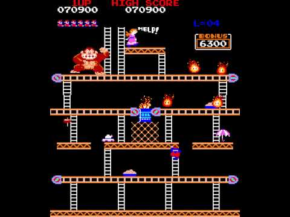

# Donkey Kong  
By... 
Maria Calle (_mav006_) 
Paula Hitz (_paulahitz8_) 
Adrià Belmonte (_croaco_) 
Irene Hernández (_ihedud_)  
~insert photo here~   
#### INDEX: 
1. Game description 
2. General analysis 
3. Design 
4. UI 
5. Audio 
6. Art   
#### 1. GAME DESCRIPTION 
Donkey Kong is an arcade platform video game created by Nintendo in 1981. It is about a protagonist character, Mario (or Jumpman as it was called back then), who has to rescue a lady (Pauline) that has been kidnapped by an enormous gorilla named Donkey Kong. The player goes through different scenarios and has to dodge whatever attacks Donkey Kong throws against him in order to rescue Pauline.Donkey Kong is one of the most important games from the golden age of arcade video games as well as one of the most popular and greatest arcade games of all time.  
  
<iframe width="560" height="315" src="https://www.youtube.com/embed/rYNMatF5hcU?start=17">
</iframe>  
#### 2. GENERAL ANALYSIS 
##### 1. Genre, similar games, market positioning. 
Donkey Kong is a platform game in which the player controls a character named Mario. There are many similar games (it has been said that it was the first platform game ever, which means that it inspired every platform game made from then on), like Don Doko Don (1989) or  Aldo’s Adventure (1987), which was heavily inspired on Donkey Kong. 
Donkey Kong succeeded commercially in Japan, but, most of all, it became extremely popular in the United States and Canada. The game's initial 2,000 units sold, and more orders were made. Arakawa began manufacturing the electronic components in Redmond because waiting for shipments from Japan was taking too long.  By October, Donkey Kong was selling 4,000 units a month, and by late June 1982, Nintendo had sold 60,000 Donkey Kong machines overall and earned $180 million. 
##### 2. Technical profile: hardware used (gpu, memory), original resolution, fps, etc. 
About technical specifications, the game uses a Z80 @3.072 MHz CPU, and is displayed in a Raster monitor (vertical, 224 x 256 resolution, 256 out of 768 colors). The hardware has the memory capacity for displaying 128 foreground sprites at 16x16 pixels each and 256 background tiles at 8x8 pixels each. Mario and all moving objects use single sprites, the taller Pauline uses two sprites, and the larger Donkey Kong uses six sprites.The character set, scoreboard, upper HUD display, and font are almost identical to Radar Scope, with palette differences. 
##### 3. History of the game: Original creators, date of release, hardware, history of versions, etc. 
Nintendo had been trying to get popular in America, but all efforts hadn’t come to anything, like Space Radar, a game that left Nintendo with many copies unsold. 
To to do something with them, the company's president, Hiroshi Yamauchi, thought of turning them into something new, keeping the same hardware and software. They wanted to “reuse” all of them for another game. He put Shigeru Miyamoto to it and appointed Nintendo chief engineer Gunpei Yokoi to oversee the project. Nintendo's game development budget was $ 100,000. 
At the time, Nintendo was trying to get licence for Popeye, but failed. They took the opportunity to create new characters that could then be marketed and used in later games. Miyamoto came up with a love triangle between a gorilla, a carpenter, and a girl that was similar to the romantic plot from Popeye . Miyamoto decided that one of the characters would be an ape, which he said was "nothing too evil or repulsive", and said ape would be the pet of the main character, "a funny, hang-loose kind of guy”. 
The circuit board of Radar Scope was restructured for Donkey Kong. The Radar Scope hardware had functions Donkey Kong did not require, se they were removed and reduced the scale of the circuit board.While the gameplay and graphics were reworked for updated ROM chips, the existing CPU, sound hardware and monitor were left intact. 
The game officially went on sale in July 1981. 
Makers of video game consoles became interested when the success became clear. Taito offered a considerable sum to buy all rights to Donkey Kong, but Nintendo turned them down. With the popularity that Donkey Kong acquired, many companies began to want to make versions for their own consoles. 
For example, Coleco did made a version to ColecoVision console. Six months later, Coleco offered Atari 2600 and Intellivision versions as well. Coleco's sales doubled to $500 million and its earnings quadrupled to $40 million. Coleco's console versions of Donkey Kong sold six million cartridges in total, grossing over $153 million, and earning Nintendo more than $5 million in royalties. Coleco also released stand-alone Mini-Arcade tabletop versions of Donkey Kong, which, along with Pac.Man, Galaxian and Frogger sold three million units combined. Meanwhile, Atari got the license for computer versions of Donkey Kong and released it for the Atari 400 and 800. Miyamoto created a greatly simplified version for the Game & Watch multiscreen handheld device. Other ports include the Apple II, Atari 7800, Intellivision, Commodore VIC-20, Famicom Disk System, IBM PC booter, ZX Spectrum, Amstrad CPC, MSX, Atari 8-bit family and Mini-Arcade versions.   
#### 3. DESIGN 
##### 1. Narrative structure: Description of the background storyline for the game. 
Donkey Kong is considered to be the earliest video game with a storyline that visually unfolds on screen. The eponymous Donkey Kong character is the game's villain. The hero is a carpenter originally unnamed in the Japanese arcade release, later named Jumpman and then Mario. Donkey Kong kidnaps Mario's girlfriend, originally known as Lady, but later renamed Pauline. The player must take the role of Mario and rescue her. This is the first occurrence of the damsel in distress scenario that provided the template for countless video games to come. 
The game opens with the gorilla climbing a pair of ladders to the top of a construction site. He sets Pauline down and stomps his feet, causing the steel beams to change shape. He moves to his final perch and sneers. A melody plays, and the level (or stage) starts. This brief animation sets the scene and adds background to the gameplay, a first for video games. Upon reaching the end of the stage, another cutscene begins. A heart appears between Mario and Pauline, but Donkey Kong grabs her and climbs higher, causing the heart to break. The narrative concludes when Mario reaches the end of the stage. He and Pauline are reunited, and a short intermission plays. The gameplay then loops from the beginning at a higher level of difficulty, without any formal ending. 
##### 2. Analysis of each level: difficulty, items / power-ups / enemies / bosses. Collision layout.  
The game is divided into four different one-screen stages. Each represents 25 meters of the structure Donkey Kong has climbed, one stage being 25 meters higher than the previous. The final screen occurs at 100 m. Later ports of the game omit or change the sequence of the screens; the original arcade version includes: 
1. Screen 1 (25 m)—Jumpman/Mario must scale a seven-story construction site made of crooked girders and ladders while jumping over or hammering barrels and oil barrels tossed by Donkey Kong. The hero must also avoid flaming balls, which generate when an oil barrel collides with an oil drum. Players routinely call this screen "Barrels". 
2. Screen 2 (50 m)—Jumpman/Mario must climb a five-story structure of conveyor belts, each of which transports pans of cement. The fireballs also make another appearance. This screen is sometimes referred to as the "Factory" or "Pie Factory" due to the resemblance of the cement pans to pies. 
3. Screen 3 (75 m)—Jumpman/Mario rides up and down elevators while avoiding fireballs and bouncing objects, presumably spring-weights. The bouncing weights (the hero's greatest danger in this screen) emerge on the top level and drop near the rightmost elevator. The screen's common name is "Elevators". 
4. Screen 4 (100 m)—Jumpman/Mario must remove eight rivets, which support Donkey Kong. The fireballs remain the primary obstacle. Removing the final rivet causes Donkey Kong to fall and the hero to be reunited with the Lady/Pauline. This is the final screen of each level. Players refer to this screen as "Rivets". 
These screens combine to form levels, which become progressively harder. For example, Donkey Kong begins to hurl barrels more rapidly and sometimes diagonally, and fireballs get quicker. The victory music alternates between levels 1 and 2. The 22nd level is unofficially known as the kill screen due to an error in the game's programming that kills Jumpman after a few seconds, effectively ending the game. With its four unique levels, Donkey Kong was the most complex video game at the time of its release, and only the second game to feature multiple levels. 
##### 3. Gameplay: Describe the mechanics of how the player actually plays the game. What rules does the game implement? What objects need to be defined, what events need to be raised, and what actions are fired for each event? It may be useful to break the objects down into subcategories - player character, 'non-player characters' (e.g. 'monsters'), room objects (walls, doors), scoring/health objects (treasure, fuel pellets, first aid kits etc.), controller objects etc. 
##### 4. Controls: Describe the user controls and how these relate to user actions (keyboard/mouse/gamepad). 
#### 4. UI 
#### 5. AUDIO 
#### 6. ART 
